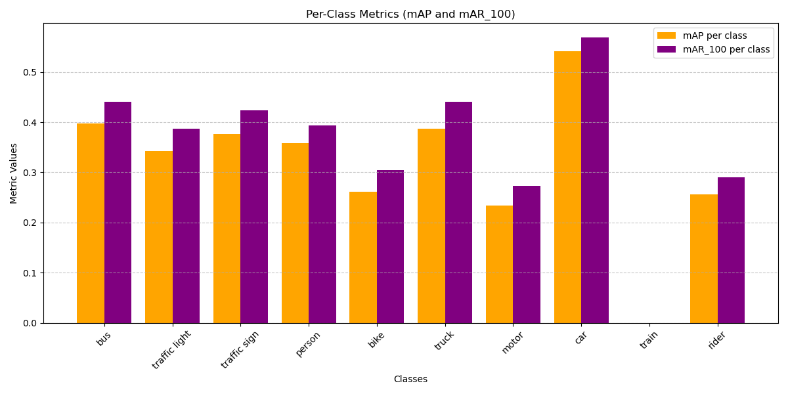

[TOC]


# Object-Detection-pipeline-on-BDD100K-dataset


---

---

## Input data analysis

---


### Command to build the Docker image

```shell
# Git clone the repository
git clone https://github.com/gaureshshirodkar/Object-Detection-pipeline-on-BDD100K-dataset.git

# Navigate to input analysis directory
cd Object-Detection-pipeline-on-BDD100K-dataset\input_analysis

# To create docker container 
docker build -t input-data-analysis .

# To save docker container image
docker save -o input_analysis.tar input_data_analysis

# To run the docker container
# path_to_data: Path where the training and validation dataset json files are saved
# bdd100k_labels_images_train.json: Training labels json file name
# bdd100k_labels_images_val.json: Validation labels json file name
docker run --rm -p 8050:8050 -v "C:\path_to_data:/data" -e TRAIN_LABELS_PATH=/data/bdd100k_labels_images_train.json -e VAL_LABELS_PATH=/data/bdd100k_labels_images_val.json input_data_analysis
```


### Command to load the exiting image and testing

```sh
# Load the image file
docker load -i input_data_analysis.tar

# To run the docker container
# path_to_data: Path where the training and validation dataset json files are saved
# bdd100k_labels_images_train.json: Training labels json file name
# bdd100k_labels_images_val.json: Validation labels json file name
docker run --rm -p 8050:8050 -v "C:\path_to_data:/data" -e TRAIN_LABELS_PATH=/data/bdd100k_labels_images_train.json -e VAL_LABELS_PATH=/data/bdd100k_labels_images_val.json input_data_analysis
```


### BDD100K input analysis dashboard output


### Conclusion

- Data balance is observed in terms of classes, weather distribution, time of the day and the object frequency.

- Also observed that the data is spread across whole image as shown in Object Position Distribution

- Some of the classes have very high average size. Like bus and train

- To handle these issues following measure can be taken

  - Acquire more images of the classes which are less

  - Data augmentation of the images which has the lesser present classes

  - Handle the data imbalance during model training using the weighted loss function

    


---

---

## Model Inference

---

This repository used the Yolov8s model for inference because of the high accuracy and low latency

Reference:  https://github.com/ultralytics/ultralytics

Note: 

- Model is tested on the sample video present in the repository (Path: "Object-Detection-pipeline-on-BDD100K-dataset/model_inference/sample_video_1.mp4")
- Model file is present in the model inference folder


### Testing the model inference

```sh

# Update the following variable in the infer_yolov8.py file
VIDEO_PATH = "sample_video_1.mp4"

# For testing the custom model file trained on the BDD100k dataset update the below dictionary
MODEL_PATHS = {
    'yolov8s': "best.pt"
}

# Command to run the inference
python infer_yolov8.py

```


### Output 


---

---

## Model Training

---

### Command to execute

```python
# Command
python train.py
```


----

---

## Output Analysis

----


### Testing of output analysis on sample file

```python
# Update global constant in output_analysis.py to true to use the sample file
DEBUG = True

# Test output analysis
python output_analyis.py
```


### Testing of output analysis on complete BDD datase

```python
# Update global constant in output_analysis.py to false to use the sample file
DEBUG = False

# Update the path of validation image and label file in the output_analysis.py file
VAL_IMAGE_PATH = "path_to_val_image_folder"
VAL_LABELS_PATH = "path_to_val_label.json"

# Test output analysis
python output_analyis.py
```


### Results

 Output analysis Mean average precision and Mean average recall is calculated for

- Different iou confidence
- Different bounding box size
- For individual classes




### Conclusion

- Since the input data for train was very less the model was not able to predict train class
- Model is trained to identify larger objects with higher accuracy
- Suggestion
  - Model can use augmentation to identify smaller objects 
  - Better model can be used to detect smaller object. 
